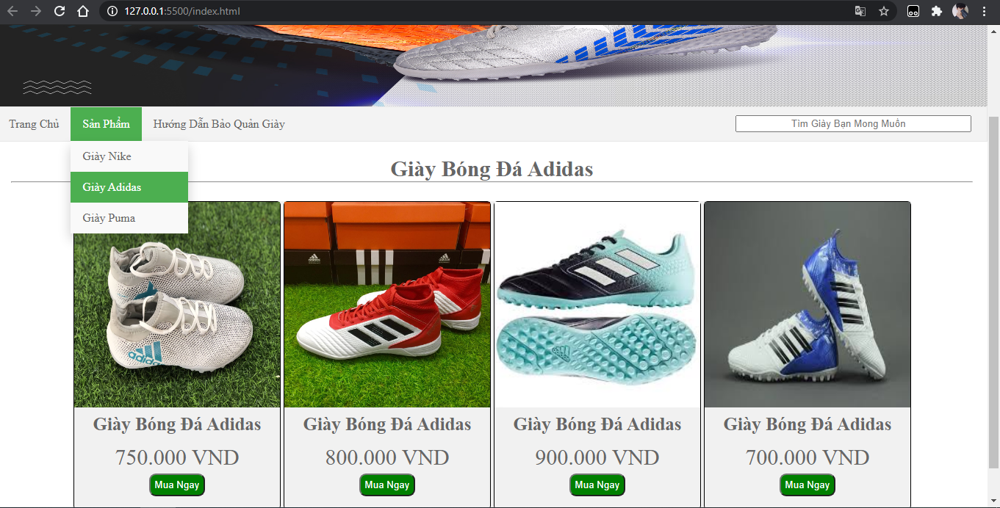
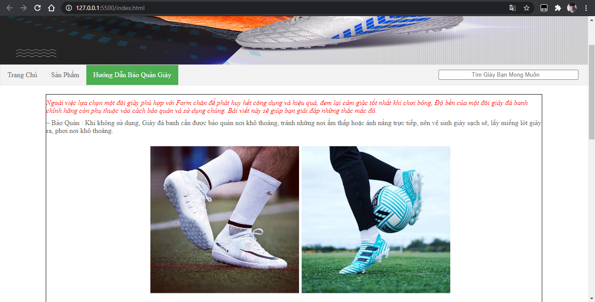

# Giao diện trang chủ website

### - khi ta scoll xuống dưới thì sẽ xuất hiện một nút back to top màu xanh bên trái

### - Đây là giao diện của sản phẩn khi ta di chuột vào nó sẽ hiển thị to hơn để chúng ta dễ dàng xem sản phẩm được rõ nét hơn

### - Tiếp đến phần giao diện  sản phẩm 
### - Khi mình muốn chọn sản phẩm thì nó sẽ được hiển thị ra
### - Ví dụ: ở đây ta chọn Giày Adidas và tiếp các sản phẩm như hình

### - Sang đến phần này thì em dùng thẻ p để in văn bản dùng thẻ em để văn bản được in nghiêng

### - và cuối cùng dùng thẻ iframe để chèn video của youtobe 

### ---- Git Hub của tôi----
 [Github](https://github.com/minhdattrinh/static-web)
 https://github.com/minhdattrinh/static-web

